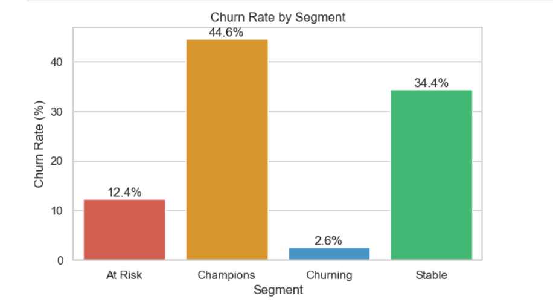
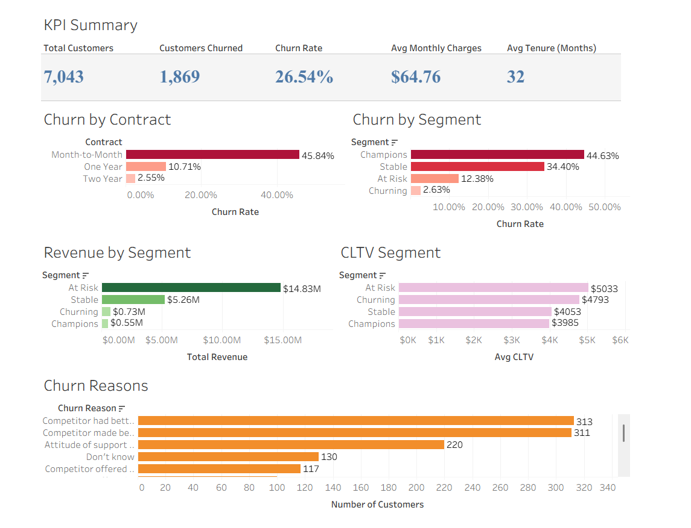

#  Customer Churn Analysis & Prediction

##  Project Overview

This project focuses on analyzing telecom customer data to understand churn behavior and identify key factors that influence customer retention. The objective is to uncover actionable insights and build predictive models that help businesses reduce customer churn and improve long-term revenue.

---

##  Objectives

* Analyze customer behavior and identify churn patterns
* Discover key factors driving customer churn
* Build machine learning models to predict churn
* Visualize insights using an interactive dashboard

---

##  Dataset

The dataset contains information on ~7,000 telecom customers, including:

* Demographics (Age, Gender, Dependents)
* Subscription details (Contract type, Services)
* Billing information (Monthly charges, Total charges)
* Customer behavior (Tenure, Referrals)
* Satisfaction score and churn status

---

##  Data Preparation

* Removed irrelevant features (CustomerID, location fields, etc.)
* Handled missing values and cleaned the dataset
* Performed feature selection for analysis and modeling

---

##  Exploratory Data Analysis

Key insights from analysis:

* ~26% of customers churned
* Higher churn observed in **month-to-month contracts**
* **New customers (low tenure)** show higher churn rates
* Customers with **low satisfaction scores (1–2)** churn significantly more
* Slight increase in churn with higher monthly charges

### Sample Visualizations



---

##  Machine Learning Models

Models used for churn prediction:

* Logistic Regression
* Random Forest

### Model Performance

* Random Forest achieved ~95% accuracy
* Better performance in identifying churned customers

### Key Features Influencing Churn

* Satisfaction Score
* Tenure
* Contract Type
* Monthly Charges

---

##  Tableau Dashboard

An interactive Tableau dashboard was created to present insights in a clear and business-friendly way.

### Dashboard Highlights

* Churn distribution and KPIs
* Churn by contract type and tenure
* Impact of pricing and satisfaction
* Customer lifetime value analysis



---

##  Business Insights

* Month-to-month contracts have the highest churn risk
* Customer satisfaction is the strongest driver of retention
* Early-stage customers are more likely to churn
* Retaining customers significantly improves lifetime value

---

##  Tools & Technologies

* Python (Pandas, NumPy, Matplotlib, Seaborn)
* Scikit-learn (Machine Learning)
* Tableau (Data Visualization)
* Jupyter Notebook
* Git & GitHub

---

##  Project Structure

```
customer-churn-analysis/
│
├── dashboard/
│   ├── customer_churn_dashboard/
│  
│
├── data/
│   └── processed
│
├── images/
│   ├── churn_by_segment.png
│   ├── customer_churn_dashboard.png
│  
├── notebook/
│   └── .ipynb_checkpoints
│
└── README.md
```

---

---

##  Conclusion

This project provides a complete end-to-end analysis of customer churn, combining data analysis, machine learning, and visualization to deliver actionable insights that can help businesses improve customer retention strategies.
