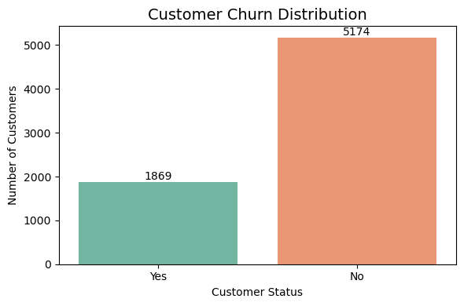
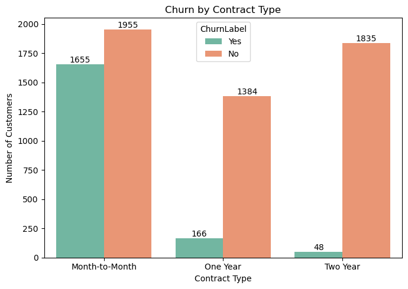
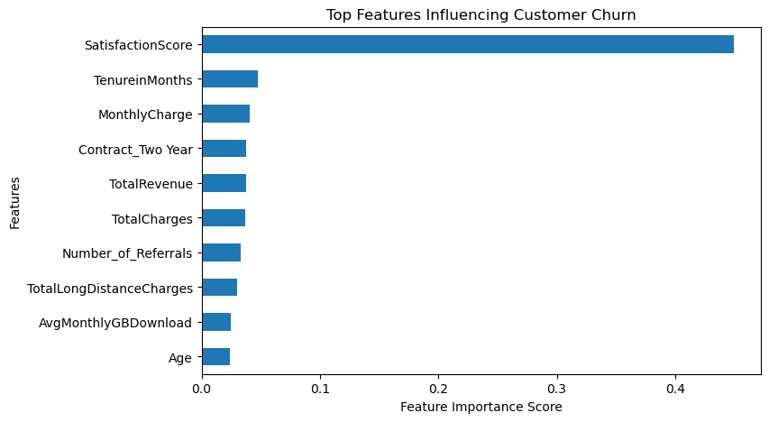
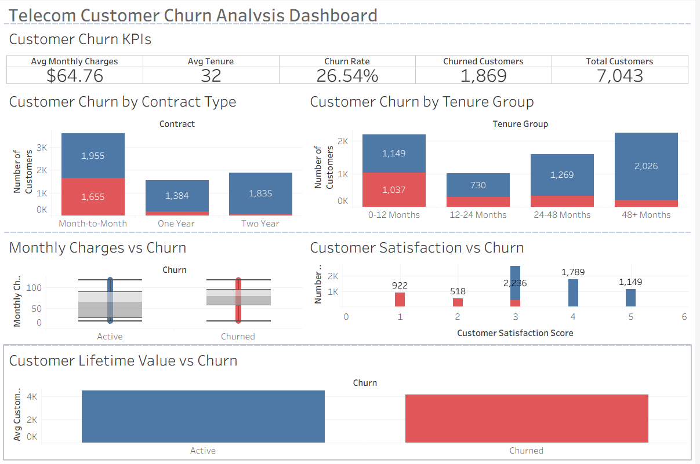

**TELECOM CUSTOMER CHURN ANALYSIS**

**Project Overview:**
This project analyzes customer churn behavior in a telecom company using Python, machine learning, and Tableau. The goal is to identify the key factors influencing churn and provide actionable insights to improve customer retention.

**Objectives:**
- Understand customer churn patterns
- Identify key churn drivers
- Build predictive models for churn prediction
- Visualize insights through an interactive dashboard

**Dataset:**
The dataset contains customer demographics, subscription details, service usage, and satisfaction scores.

Key features include:
- Customer demographics
- Contract type
- Monthly charges
- Tenure
- Customer satisfaction score
- Customer lifetime value(CLTV)

**Technologies Used:**
- Python
- Pandas
- Numpy
- Matplotlib
- Seaborn
- Scikit-learn
- Tableau

**Exploratory Data Analysis:**
Key visualizations were created to understand churn behaviour
- Churn Distribution
- Churn by Contract Type
- Feature Importance
- Churn Dashboard

**Machine Learning Models:**
Two models were used for churn prediction:
- Logistic Regression
- Random Forest
Random Forest achieved higher accuracy and better recall for churned customers.

**Tableau Dashboard:**
An interactive Tableau dashboard was built to analyze churn drivers.
Key insights include:
- Month-to-month contracts have the highest churn rate
- Customers with shorter tenure churn more frequently
- Higher monthly charges slightly increase churn probability
- Lower satisfaction scores strongly correlate with churn

**Businees Insights:**
- Contract type is a strong predictore of churn
- Customer satisfaction significantly impacts retention
- Early customer lifecycle is the highest churn risk period
- Retaining customers increases long-term revenue

